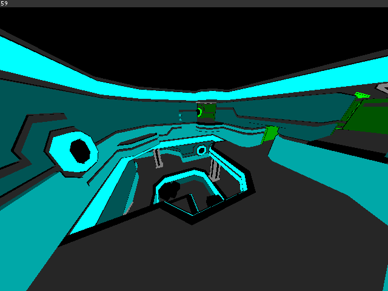
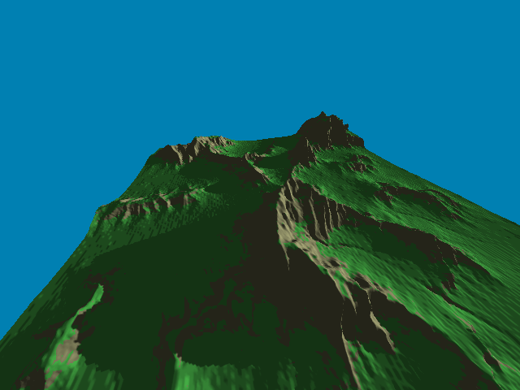
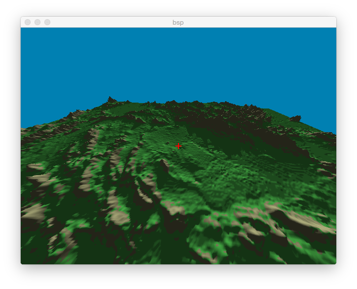
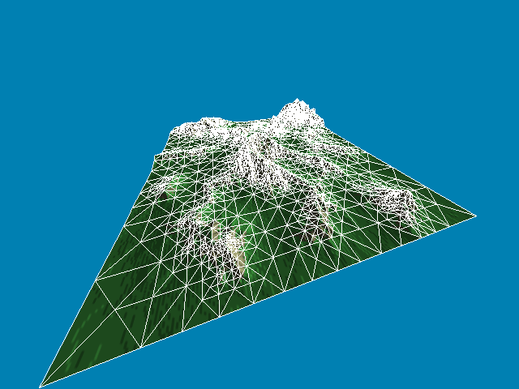

OpenGL 3.2 support:

- Intel HD 4000+ (2012 Ivy Bridge)
- Intel HD 2000+ (2011 Sandy Bridge) except for geometry shaders and
  ARB_texture_multisample
- NVIDIA 8xxx+ (2006)
- ATi HD 2000+ (2006)

OpenGL 3.3 support:

Same as above. Sandy Bridge doesn't support ARB_texture_swizzle or
ARB_blend_func_extended.

See http://www.g-truc.net/doc/OpenGL%203%20Hardware%20Matrix.pdf
